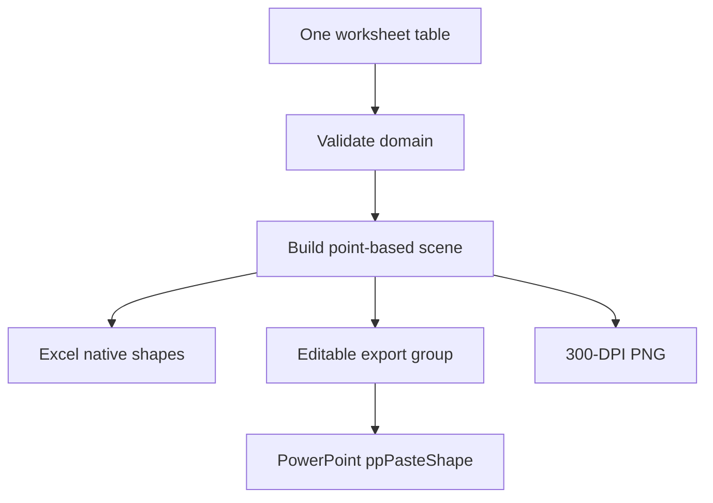

# 02-ARCHITECTURE

> Always-on rule. Regenerated by `scripts/sync-cline-skills.ps1` from `docs/02-ARCHITECTURE.md`. Do not edit it by hand; edit the canonical source and re-run the sync.

# Product and architecture — revision 3

> Created 2 September 2026 under a new filename. This revision defines the scope, schema, lifecycle, migration and non-security status of the approved `_GanttCreatorConfig` VeryHidden worksheet. When installed, use the path `docs/02-ARCHITECTURE.md`.

## Product boundary

The add-in creates fast, presentation-quality construction-delay visuals from one visible worksheet. It is a drawing tool backed by tabular schedule events, not a critical-path scheduling engine. It must not imply that it calculates contractual entitlement, CPM logic, or delay causation.

## Build pipeline artifact contract

The build pipeline produces artifacts in a deterministic order. Tests may
only consume artifacts that a verify-script step guarantees:

- `verify-quick.ps1` and `verify.ps1` are the authoritative producers of
  `bin/`, `coverage/`, and `publish/` artifacts.
- A test that reads from `bin/` or `publish/` must be traceable to a
  specific step in those scripts. The traceability lives in the work item.
- A test must not assume prior build state. It either creates its own
  inputs, or depends on a verify-script step whose existence is asserted
  by the work item.

## User worksheet contract

The first supported schema is an Excel Table named `tblGanttData` on the active worksheet. The table is visible and adjacent to the Gantt plot.

Required columns:

| Column | Type | Meaning |
| --- | --- | --- |
| `Id` | text | Stable event identifier; generated once, never row-number based |
| `LaneId` | text | Stable visual-lane identifier shared by events on the same line |
| `StackIndex` | whole number | Non-negative vertical-band order; equal values deliberately share one line |
| `Type` | catalogue text | In-cell dropdown from the single `EntityTypeCatalog` defined by the entity guide |
| `Description` | text | User-facing label |
| `Start` | Excel date or blank | Inclusive start for span events; the single date for a milestone/delineator |
| `Finish` | Excel date or blank | Inclusive finish for span events; not read for milestones/delineators |
| `ParentId` | text or blank | Owning activity for critical/child entities |
| `StyleKey` | catalogue text or blank | Blank uses Type default; otherwise an approved named style |
| `LabelPosition` | catalogue text or blank | Explicit supported position; blank resolves to the Type default/Auto |
| `FillColour` | `#RRGGBB` or blank | Per-row rectangle/diamond/splitter fill override |
| `StrokeColour` | `#RRGGBB` or blank | Per-row outline, hatch, critical, or delineator colour override |
| `Visible` | Boolean or blank | Blank/true renders; false retains the row without rendering |

Optional columns can be added only by an approved schema ADR, initially `SortOrder` and user notes. Core data columns remain visible; property columns may be shown/hidden using the Ribbon but remain on the same worksheet. Do not introduce one column per critical interval. A critical interval is another event record tied to a lane or parent.

Workbook-level configuration uses one worksheet named `_GanttCreatorConfig` with `Visible = xlSheetVeryHidden`, plus workbook-defined names prefixed `GanttCreator.` that point to its validation ranges. Shape ownership uses a deterministic shape name plus tags/alternative text.

## VeryHidden configuration worksheet contract

The workbook contains exactly:

- one visible user worksheet containing `tblGanttData` and the live Gantt; and
- one add-in-managed `_GanttCreatorConfig` worksheet with `xlSheetVeryHidden` visibility.

The configuration worksheet contains versioned tables/ranges only:

| Item | Purpose |
| --- | --- |
| `tblGanttTypes` | Materialised built-in Type values, display names, entity kind, date mode, default style and capability flags |
| `tblGanttStyles` | Workbook style presets and user-approved custom named styles |
| `tblGanttMetrics` | Rectangle heights, milestone size, gaps, line widths and other named geometry tokens |
| `tblGanttLabelPositions` | Valid label choices grouped by entity capability |
| `tblGanttConfig` | Schema version, catalogue hash, workbook ID and add-in version last used |
| `GanttCreator.TypeOptions` | Workbook name referring to the active Type display-name range used by data validation |

Built-in Type definitions remain code-owned and are materialised deterministically. The helper worksheet is the workbook-scoped validation/configuration representation, not a second competing type catalogue.

The helper must never contain activity/event rows, descriptions, schedule dates, scene primitives, rendered shapes, formulas that determine chart geometry, logs, or export staging. It is excluded from all exports and normal navigation. `xlSheetVeryHidden` and worksheet protection prevent accidental edits but are not treated as security.

On initialise/open/Refresh, validate sheet name, visibility, schema version, table headers, defined names and catalogue hash. Rebuild missing built-in catalogue rows safely. Preserve valid user style presets during a schema migration. If repair could lose custom configuration, stop and request confirmation rather than silently recreating the sheet.

If a user copies only the visible worksheet into another workbook, the add-in detects the missing configuration sheet and offers to initialise it from code defaults. It does not refuse to read the visible schedule data or copy schedule content into the helper.

## Domain model

Use immutable Core types. Suggested concepts, not mandated class names:

- `GanttDocument`: validated data, plot range, lanes, delineators, and style theme.
- `Lane`: ordered visual row with one or more events.
- `SpanEvent`: start/finish event such as planned, actual, baseline, procurement, or critical.
- `PointEvent`: milestone, date label, or delineator.
- `EventStyle`: explicit fill, stroke, thickness, hatch, marker, font, and label placement.
- `TimeScale`: maps `DateOnly` values to plot-space point coordinates.
- `Scene`: immutable ordered primitives in points.
- `ScenePrimitive`: rectangle, line, polygon, text, and group metadata.
- `ExportSize`: width, calculated height, pixel dimensions, and DPI.

Validation returns all actionable issues in deterministic table/row order. It must distinguish blocking errors from warnings. Do not throw for routine bad user input.

Key rules:

- IDs are stable and unique.
- span start is not after finish;
- lane and stack ordering is deterministic;
- milestones and delineators require one date;
- Type values come only from the central entity catalogue; unknown pasted values are blocking errors;
- row colour and label-position overrides are validated against the selected Type's capabilities;
- text is trimmed but not silently rewritten;
- date parsing uses the Excel cell value and workbook date system, not locale-dependent display text;
- events outside the selected plot range are clipped or warned according to an explicit policy;
- no shape is emitted with NaN, Infinity, negative width, or negative height.

## Scene-first rendering

Every renderer consumes the same immutable scene. Worksheet reading and layout are not repeated independently by each renderer.



The scene contains explicit z-order, geometry, style, text bounds, clipping, and stable IDs. Renderers may translate representation, but may not recalculate dates or lane geometry.

### Coordinate and rounding policy

- Scene coordinates use points (`1 inch = 72 points`) as `double` values.
- Convert dates to a day index before geometry calculation.
- Date X maps the start of a calendar day. Span finish dates and plot finish are inclusive, so their right edge uses `Finish + 1 day`; point events use their exact date without the extra day.
- Snap at one defined boundary; never round repeatedly through the pipeline.
- Excel comparisons allow a documented tolerance because COM exposes `Single` shape geometry.
- Raster mapping is `pixels = round(points / 72 * dpi * scale)`, with edge rounding chosen once and covered by boundary tests.
- One injected deterministic text-metrics service measures labels during scene construction. Its implementation, font, and version are pinned for tests. Renderers consume the resolved text bounds and may not choose a different label side.

## Live Excel renderer

The live renderer owns only shapes with the `GanttCreator` tag/prefix. It never deletes or reformats unowned content.

Refresh is idempotent:

1. Read and validate the current table/configuration.
2. Build a complete scene in memory.
3. If blocking errors exist, show them without changing existing shapes.
4. Enter an Excel application-state scope.
5. Update, create, or delete owned shapes by stable scene ID.
6. Apply z-order deterministically.
7. Restore application state even after failure.

Refresh runs only when the user invokes the Ribbon Refresh command or another explicitly documented render command. Normal cell edits, Type dropdown changes, per-row colour changes, label-position changes, and selection changes must not call the renderer. A failed Refresh leaves the last valid chart unchanged.

Per-entity Ribbon properties are enabled only for one selected expanded entity row. They write `FillColour`, `StrokeColour`, or `LabelPosition` in the table; they never directly modify the current generated shape. Collapsed roll-ups, multi-row selections, headers, and unsupported entity capabilities disable the corresponding controls.

Prefer updating existing shapes to delete/recreate when it materially preserves user selection and performance. If diff rendering becomes unreliable, replace the complete owned set atomically within the state scope; document the choice with benchmarks.

## Editable export composition

The editable export must contain no live cells because PowerPoint cannot preserve cell ranges and shapes as one reliably editable shape group. The export composer therefore reproduces selected table cells, headers, grid lines, time headers, background bands, bars, markers, delineators, and labels as native Excel shapes.

Process:

1. Build the export scene only when **Copy Editable** or **Send to PowerPoint** is clicked.
2. Place temporary shapes at a deterministic staging origin on the same worksheet, outside the user's working view, without writing cells or adding a sheet.
3. Group all temporary shapes and verify group bounds against the scene bounds.
4. Copy the group with `ShapeRange.Copy`.
5. For clipboard-only copy, verify an expected Office drawing clipboard format is present before reporting success.
6. For PowerPoint, call `Shapes.PasteSpecial` with `ppPasteShape` and verify the returned `ShapeRange`, count, and non-zero bounds.
7. Delete all temporary owned shapes in `finally` and restore selection/view state when possible.

Phase 10 contains a compatibility spike. If deletion invalidates a delayed clipboard format on a supported Office build, the approved fallback is a short-lived staging workbook retained until the copy operation is materialised—not a permanent helper worksheet. This must be decided from measured evidence.

## PowerPoint automation

Use a narrow `IPowerPointTransfer` port. The Office adapter:

- attaches to or starts desktop PowerPoint according to a user-visible policy;
- uses the active editable presentation/slide or creates a new presentation only when the button contract says so;
- calls `PasteSpecial(ppPasteShape)`;
- treats unsupported clipboard format, protected presentation, missing active slide, and COM busy/rejected-call errors as distinct failures;
- positions/scales the pasted group once, preserving aspect ratio;
- never saves, closes, or overwrites a user's presentation without a separate explicit command;
- releases only COM proxies it owns and never terminates an existing PowerPoint instance.

Retry only known transient COM rejection with a bounded message filter/deadline. Never use arbitrary sleeps.

## PNG renderer

The raster renderer consumes the same scene, plus export width and theme background.

For width in centimetres:

```text
pixelWidth  = round(widthCm / 2.54 * 300)
pixelHeight = round(pixelWidth * sceneHeightPoints / sceneWidthPoints)
```

For inches, `pixelWidth = round(widthInches * 300)`. For pixels, the entered value is the pixel width and 300 DPI metadata determines its nominal physical size. In every case:

- height is calculated, never independently entered;
- the exact scene bounds are the crop bounds;
- dimensions must be positive and under a documented memory/pixel safety limit;
- background transparency/colour is explicit;
- the PNG contains `pHYs` density values for 300 DPI (`11811` pixels per metre, subject to integer rounding);
- a post-write validator reopens the file and checks signature, dimensions, density, and non-empty image content before success is shown.

The Ribbon exposes width, unit (`cm`, `in`, `px`), and export action. It may show the calculated height and pixel dimensions before save.

## Ribbon and commands

Use RibbonX, not Office.js or a task-pane web UI. The first release groups commands by workflow:

- **Data**: initialise table, add activity, add milestone, add delineator, validate.
- **Chart**: refresh, date range, scale, workbook styling, show/hide labels.
- **Selected Entity**: shape/line colour, label position, use Type default; enabled only for one expanded entity row.
- **Export**: copy editable, send to PowerPoint, PNG width/unit, export PNG.
- **Support**: diagnostics, logs, version, offline help.

Every callback is a thin error boundary that invokes an application command. No callback contains parsing, geometry, shape-building, or PowerPoint logic. Dynamic Ribbon state getters must be fast and side-effect-free.

## COM ownership and application state

Interop is the highest-risk layer. Follow these rules:

- Access Office only from the Excel main STA thread unless an approved marshaling design says otherwise.
- Avoid `foreach` on COM collections when it creates hidden enumerator proxies.
- Avoid chained expressions such as `app.ActiveWorkbook.Worksheets[1].Range[...]`.
- Capture each proxy, define who releases it, and release in reverse order.
- Never aggressively call `FinalReleaseComObject` on shared/root proxies without a documented ownership proof.
- Use one tested state-scope type to save and restore application settings.
- Include operation ID, HRESULT, Office build, and stage in technical logs. Exclude schedule content by default.

## Error handling

Expected user/data errors return typed results. Unexpected exceptions cross one command boundary where they are logged and translated to a concise message containing an operation ID. Do not scatter message boxes through lower layers.

Failure must be transactional where practical:

- invalid data leaves the existing chart unchanged;
- partial temporary export shapes are removed;
- Excel settings and selection are restored;
- PowerPoint is not closed or saved;
- incomplete PNG files are deleted or written through an atomic temporary path.

## Performance budgets

Initial budgets, to be confirmed with representative synthetic fixtures:

- validate and build a scene for 1,000 events: under 250 ms on the reference machine;
- refresh 1,000 live shapes: under 2 seconds after warm-up;
- build/copy a 1,000-object editable export: under 5 seconds;
- render a 5,000-pixel-wide PNG: under 3 seconds and under 500 MB peak working memory.

Do not optimise before profiling. Record the reference hardware and Office build with benchmark results.

## Out of scope for the first release

- Mac, Excel Online, Office.js, Google Sheets, and mobile;
- native CPM calculation, calendars, resource levelling, or schedule-file import;
- automatic legal/contractual delay analysis;
- collaborative co-authoring conflict resolution;
- arbitrary user-authored shape templates;
- editable `.pptx` file generation or automatic presentation saving;
- cloud storage, telemetry, accounts, or licensing services.
